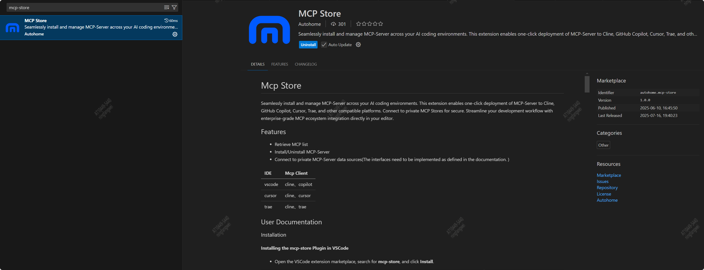
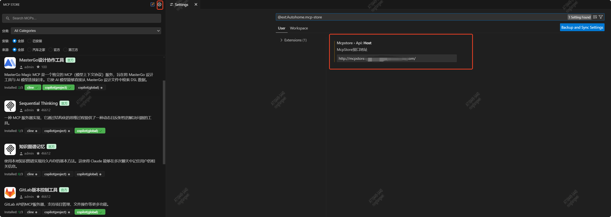
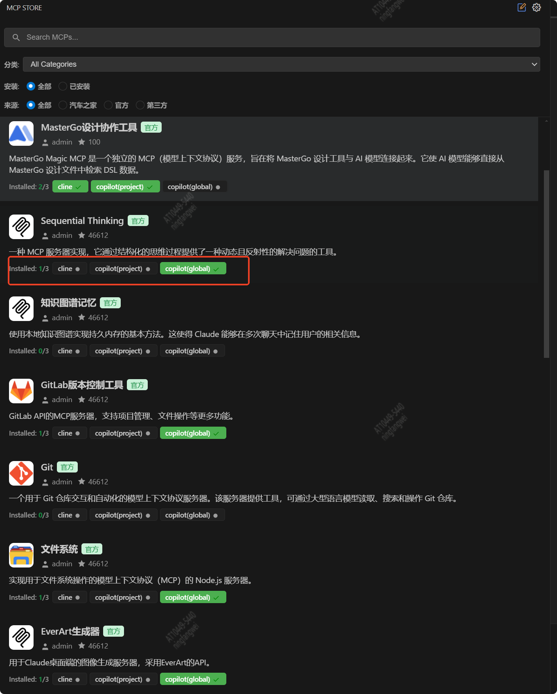

# Mcp Store

Seamlessly install and manage MCP-Server across your AI coding environments. This extension enables one-click deployment of MCP-Server to Cline, GitHub Copilot, Cursor, Trae, and other compatible platforms. Connect to private MCP Stores for secure. Streamline your development workflow with enterprise-grade MCP ecosystem integration directly in your editor.

## Features

- Retrieve MCP list
- Install/Uninstall MCP-Server
- Connect to private MCP-Server data sources

IDE | Mcp Client
--- | ---
vscode|cline、copilot
cursor|cline、cursor
trae|cline、trae

## User Documentation  

### Installation  

#### Installing the mcp-store Plugin in VSCode  

- Open the VSCode extension marketplace, search for **mcp-store**, and click **Install**.  

  

#### Installing the mcp-store Plugin in Trae  

- Open the Trae extension marketplace, search for **mcp-store**, and click **Install**.  

**Note:** By default, Trae syncs with the official VSCode extension marketplace, but there may be delays (ranging from minutes to days). To avoid this, we recommend setting the marketplace URL to **[https://open-vsx.org/](https://open-vsx.org/)** (extensions are published in real-time to both the official VSCode marketplace and Open-VSX).  

  

#### Installing the mcp-store Plugin in Cursor  

- Open the Cursor extension marketplace, search for **mcp-store**, and click **Install**.  

**Note:** Cursor syncs with the official VSCode extension marketplace by default, but synchronization delays may occur—ranging from minutes to several days.  

## Usage  

### Setting the mcp-server API Address  

- If the **mcp-server API address** is not configured, opening the VSCode extension marketplace will automatically redirect to the settings page, highlighting the API address field.  
- To update the **mcp-server API address**, click the settings button in the plugin function page header.  

  

### Installing/Uninstalling mcp-server  

- Open the plugin function page to view all available **mcp-server** listings.  
- Each **mcp-server** entry displays installable **mcp-client** options below it:  
  - **Green** = Installed  
  - **Gray** = Not Installed  
- Click a gray **mcp-client** to install it; click a green one to uninstall.  

  

### Starting mcp-server  

- **Cline**: Starts automatically after installation.  
- **Trae**: Starts automatically after installation.  
- **Copilot**: Requires manual startup.  
  - In VSCode, run **mcp:list servers** to view the configured **mcp-server** list and start the desired server.  

> Press **Ctrl + Shift + P** to open the command palette, then type **mcp:list servers**.  

  

> Select the desired **mcp-server** and click it.  

  

> Click **Start Server** to launch the **mcp-server**.  

  

- **Cursor**:  
  - If added to global settings, it starts by default.  
  - If added to a workspace, manual startup is required (go to **Settings > MCP Tab**, select the desired **mcp-server**, and click **Start**).  

  


## Interface Definition

The server must implement the following interface functionalities:

- Get mcp-server list
- Get mcp-server details
- Get mcp-server source list
- Metric Report
- Get mcp-store configuration
- 
### 1. Get mcp-server List

#### Request

`POST /v1/store/server/list`

#### BODY

| Parameter | Type | Description | Required |
---|---|---|---|
| pageSize | number | Items per page | Yes |
| pageIndex | number | Page number | Yes |
| keyword | string | Search keyword | No |
| serverCategoryId | number | Category ID | No |
| source | number | Source | No |
| names | string[] | Name list (for installed items) | No |
| namesFilterType | number | MCPServer name filter type (1: in; 2: not in). Required if names parameter is provided | No (Required when names has value) |

#### Response

| Parameter | Type | Description 
---|---|---
| returncode | number | Status code 
| message | string | Description 
| result | object | Result 
| result.rowcount | number | Total count 
| result.pagecount | number | Total pages 
| result.pageindex | number | Current page number 
| result.list | array | mcp list
| result.list.name | string | mcp name 
| result.list.gitUrl | string | mcp git URL 
| result.list.description | string | mcp description 
| result.list.logoUrl | string | mcp logo URL 
| result.list.source | number | mcp source 
| result.list.supplier | string | mcp supplier 
| result.list.submitter | string | mcp submitter 
| result.list.gitStarCount | number | mcp git star count
| result.serverCategories | array | mcp category list
| result.serverCategories.id | number | mcp category id
| result.serverCategories.name | string | mcp category name
| result.serverCategories.serverCount | string | Count of MCPServer in this category

Success response:

```json
{
"returncode": 0,
"message": "",
"result": {
  "rowcount": 29,
  "pagecount": 2,
  "pageindex": 1,
  "list": [
        {
          "name": "EverArt Generator",
          "gitUrl": "https://github.com/modelcontextprotocol/servers/tree/main/src/everart",
          "description": "Image generation server for Claude desktop client using EverArt's API.",
          "logoUrl": "https://xxx.cn/dealer_microfe_aidev/mcp/img/mcp-server-logo/modelcontextprotocol.png",
          "source": 2,
          "supplier": "modelcontextprotocol",
          "submitter": "admin",
          "gitStarCount": 46612
        }
      ],
  "serverCategories": [
      {
      "id": 1,
      "name": "Developer Tools",
      "serverCount": 0
      }
    ]
  }
}
```

Error response:

```json

{
  "returncode": 500,
  "message": "Retrieval failed, xxxx",
  "result": null
}

```

### 2. Get mcp-server Details

#### Request

`GET /v1/store/server/detail`

#### Parameters

| Parameter | Type | Description | Required |
---|---|---|---|
| name | string | mcp name | Yes |

#### Response

| Parameter | Type | Description |
---|---|---|---|
| returncode | number | Status code |
| message | string | Description |
| result | object | Result |
| result.name | string | mcp name |
| result.serverConfig | string | mcp startup configuration command, can be parsed into JSON object using `JSON.parse`. Corresponds to the `mcpServerConfig` field in client. |

Success response:

```json
{
  "returncode": 0,
  "message": "",
  "result": {
    "name": "File System",
    "serverConfig": "{\"mcpServers\":{\"filesystem\":{\"args\":[\"-y\",\"@modelcontextprotocol/server-filesystem\",\"/Users/username/Desktop\",\"/path/to/other/allowed/dir\"],\"command\":\"npx\"}}}"
  }
}

```

Error response:

```json

{
  "returncode": 500,
  "message": "Retrieval failed, xxxx",
  "result": null
}

```

### 3. Get mcp-server Source List

#### Request

`GET /v1/store/server/sources`

#### Parameters

None

#### Response

| Parameter | Type | Description 
---|---|---
| returncode | number | Status code 
| message | string | Description 
| result | array | Result 
| result.id | number | Source ID 
| result.name | string | Source name 

Success response:

```json
{
  "returncode": 0,
  "message": "",
  "result": [
    {
      "id": 1,
      "name": "Autohome"
    }
  ]
}
```

Error response:

```json

{
  "returncode": 500,
  "message": "Retrieval failed, xxxx",
  "result": null
}

```

### 4. Metric Data Reporting

#### Request

`POST /v1/store/report`

#### Parameters

| Parameter | Type | Description | Required | Remarks |
---|---|---|---|---|
| mcpServerName | string | mcp-server name | Yes | Example: Grafana MCP Server |
| target | string | Target mcp-client name for installation | Yes | Example: cline |
| source | string | Data source name | Yes | Example: vscode-extension |
| username | string | Username | Yes | Example: ningfangwei |
| userIp | string | User IP address | Yes | Example: 127.0.0.1 |
| userOs | string | User operating system | Yes | Example: mac |
| eventTime | date | Event timestamp | Yes | Example: 2024-05-28 10:00:00 |
| eventName | string | Event name (install: installation, uninstall: uninstallation) | Yes | Example: install |

#### Response

| Parameter | Type | Description |
---|---|---|
| returncode | number | Status code |
| message | string | Description |

Success response:
```json
{
  "returncode": 0,
  "message": "success"
}
```

Error response:

```json

{
  "returncode": 500,
  "message": "Reporting failed, xxxx"
}

```

### 5. Get Store Configuration Information
#### Request

`GET /v1/store/config`

#### Parameters

None

#### Response

| Parameter | Type | Description 
---|---|---
| returncode | number | Status code
| message | string | Description
| result | object | Configuration information
| result.title | string | Store title
| result.submitServerUrl | string | Server submission URL
| result.issueUrl | string | Communication URL

Success response:
```json
{
  "returncode": 0,
  "message": "success",
  "result": {
    "title": "mcp Store",
    "submitServerUrl": "https://example.com/submit",
    "issueUrl": "https://example.com/issue"
  }
}
```

Error response:

```json

{
  "returncode": 500,
  "message": "Retrieval failed, xxxx",
  "result": null
}

```